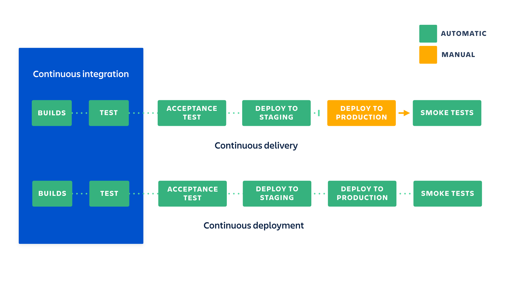
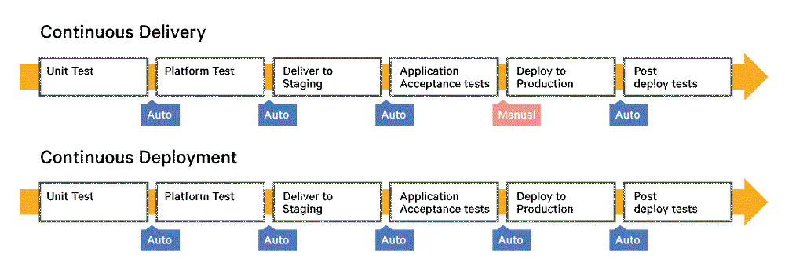
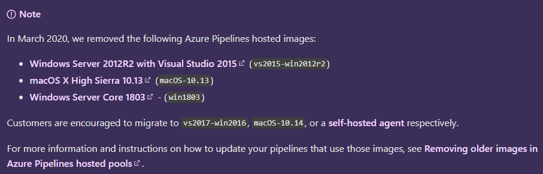

# Continuous Delivery / Continuous Deployment

- [Continuous Delivery / Continuous Deployment](#continuous-delivery--continuous-deployment)
  - [Overview](#overview)
  - [GitHub Actions](#github-actions)
  - [Azure Pipelines](#azure-pipelines)
  - [Docker](#docker)
  - [Kubernetes](#kubernetes)

## Overview

- https://dzone.com/articles/continuous-delivery-vs-continuous-deployment-an-ov
- https://www.atlassian.com/continuous-delivery/principles/continuous-integration-vs-delivery-vs-deployment

- Your team will need to write automated tests for each new feature, improvement or bug fix.
- You need a continuous integration server that can monitor the main repository and run the tests automatically for every new commits pushed.

## GitHub Actions

- Quickstart: https://docs.github.com/en/actions/quickstart
- Self-hosted runners: https://docs.github.com/en/actions/hosting-your-own-runners/about-self-hosted-runners
- Starter Workflow: https://github.com/actions/starter-workflows
- Actions on GitHub Enterprise: https://docs.github.com/en/enterprise-server@2.22/admin/github-actions/managing-access-to-actions-from-githubcom/about-using-actions-in-your-enterprise

## Azure Pipelines

- https://azure.microsoft.com/en-us/services/devops/pipelines/
- Comparison: https://docs.microsoft.com/en-us/dotnet/architecture/devops-for-aspnet-developers/actions-vs-pipelines

 > https://docs.microsoft.com/en-us/azure/devops/pipelines/agents/hosted?view=azure-devops&tabs=yaml#use-a-microsoft-hosted-agent

## Docker

- https://www.docker.com/

## Kubernetes

- https://kubernetes.io/
